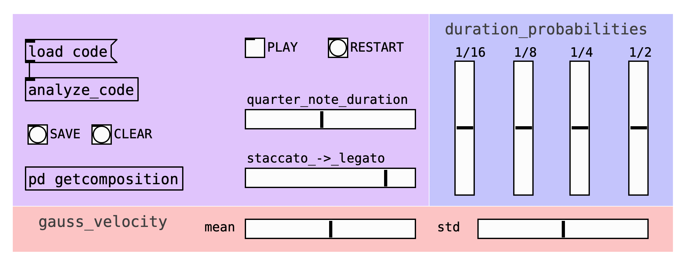

# Computational Music Creativity 
Materials for the Computational Music Creativity course at UPF-MTG (Spring 2020)

## Assignments

### Bang counter

[Patch](assignmnets/intro/bang-counter.pd)

### Step sequencer

[Patch](assignments/into/step-sequencer.pd)

### Theremin

[Patch](assignments/theremin/thermin.pd)

## Granular synthesizer

[Project](assignments/granular-synth) | [Demo](https://youtu.be/iii65FQ2uug)

## Markov composition

[Project](assignments/markov) | [Demo](https://youtu.be/iXz9Xa6568Q)