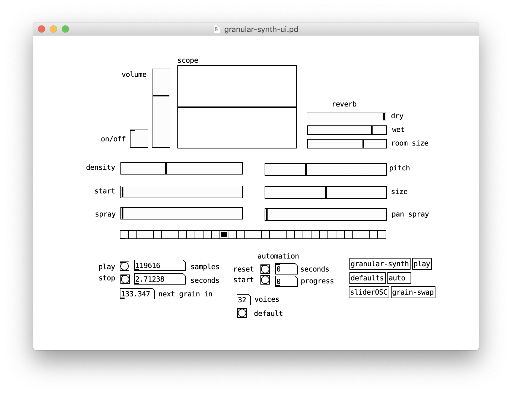

# Granabular 
A collaborative granular synth


## Overview

Granabular is a granular synthesizer that is operated by multiple 
users concurrently. Each user is assigned a different parameter of the
synthesizer and they must work together in order to create a composition 
in real time. 

There are three main components:
- Flask web app (server) [Python]
- Front-end webpage (client) [HTML/CSS/JS]
- Granular engine (synthesizer) [Pure Data]

## Setup

First create a virtual environment and install Python dependencies.
``` 
cd granabular
python3 -m venv env/
source env/bin/activate
pip install requirements.txt
```

Install [Freesound Python API client](https://github.com/MTG/freesound-python)
```
git clone https://github.com/MTG/freesound-python.git
cd freesound-python
python setup.py install
```

And then get an API key from [here](https://freesound.org/apiv2/apply/) 
and store it in an environment variable.
```
export FREESOUND_API_KEY=YOUR_KEY_HERE
```

Finally launch the Flask server.
```
export FLASK_ENV=development
flask run --host 0.0.0.0 --cert=adhoc
```

Next you will need [Pd Vanilla](https://puredata.info/downloads/pure-data) installed
as well as a few externals: cyclone, mrpeach, and zexy. 

Navigate to `pd/` and open the `granular-synth-ui.pd` path, as this is the main
interface to the granular synthesizer engine. To enable the synthesizer you will 
need to tick the `on/off` toggle. Also make sure to enable DSP and correctly configure
you audio output device for hearback. 



Then visit the live site at [https://0.0.0.0:5000](https://0.0.0.0:5000).
For other users on the network to access the site, they much connect
with your local IP address which can be found by running `ifconfig` in the terminal.

When you first connect to the site you will see a scary warning because of SSL
certificate created locally has not been signed. There is no reason for concern though,
and all you need to do is click through to proceed onto the site. Once you have done
this the first time you should not be asked again. 


Also, after pressing the join button you will be asked to provide access to the microphone.
Simply click allow and you will not be asked again. The microphone will be accessed periodically
to record grains that will be sent to the server and then the synthesizer. User's will always
be alerted that a recording is occuring when  when the background changes to orange and red
and shows a message *Grain Recording*. 


