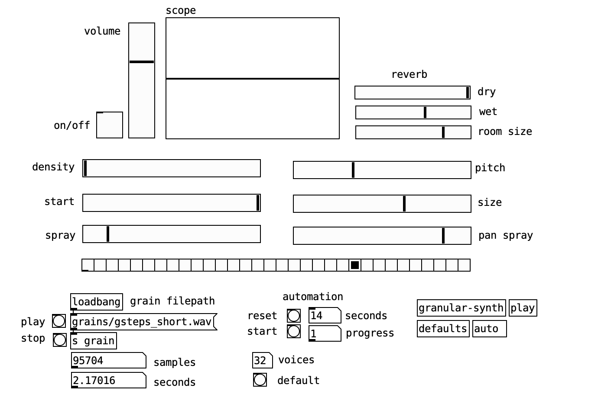

# Granular synthesizer
Christian Steinmetz - 05.02.2020

## Usage

The main patch is `granular-synth-ui.pd`. 
After opening it you should see something like this. 

By default, this will automatically load the filename from the previous usage. We store all our grain files (16/44.1 WAVs) in a folder at the same level called `grains`. 

We also use the [freeverb external](https://puredata.info/downloads/freeverb), which you will need to install if you do not already have it. 

## Controls

To start, it is often nice to preview the loaded sound file. This can be done by pressing the **play** button on the left hand side. This will play the loaded audio file from start to finish. You can stop the playback at anytime by pressing **stop**. You will also see the total number of samples in the file as well as how many seconds long it is. 

With your file loaded you can enable the synth by pressing the **on/off** toggle on the top left. This will start playback of the grains. You will see that when a grain is played the radio on the bottom will signal. In total, there are 32 voices, i.e. 32 different granular modules that can playback a grain at the same time (this may consume quite a bit of CPU). This is done to allow for very high densities without artifacts. You can change the number voices at anytime using the number box show in the center bottom. 

By default, the **density** will be set very low. You can then use the **size** control to change how large each grain is. The **start** control sets where each grain starts playing from within the file. This can be adjusted by increasing the **spray** control, which will randomly shift the starting point of the grain. The greater the **spray** the large area the starting point is sampled from the file. 

On the other-hand, **pan spray** simply changes how each grain is panned in the stereo field on playback. By default this is set to 0 meaning that each grain is played in the center. Increasing it to the maximum will mean that each grain will be played anywhere at random in the stereo field (and this works best with a high density to help reduce comb-filtering). 

An interesting feature of the granular synth is that it allows you to change the pitch of the sound without changing its playback speed. The **pitch** control will allow you adjust the pitch in this way within a limit. Due to the current implementation, you should be careful as it is possible to introduce artifacts by stretching the pitch too much. 

To make the samples a bit more lush there is as a very simple reverb. There are controls for the **dry** and **wet** signal levels, as well as the **room size** (we recommend big). The reverb has a few more parameters but to keep the main UI clean these aren't show on the front page and can be adjusted in the `granular-synth.pd` patch if desired. 

Finally there is a (*very* simple) automation system that will automatically seek through the start point of the audio file. You first must set the playback time. This defines how long it will take for the automation to play through the whole file in seconds. Then you can press the **start** button to make the automation begin. Then as it seeks through the file you can adjust other settings. Press the **reset** button to return the start slider back to the 0 position. 

## Samples

Here are a few different pieces made using this synth without any kind of post-processing. At the start of each sample the original sound is played.

[Bikini girls by Sven Libaek](https://youtu.be/3Nof2aVZMdI)
[Cubrámonos con Cenizas by Pluhar](https://youtu.be/y5ij-I8zVjE)
[Window XP startup](https://youtu.be/iii65FQ2uug)
[Dialup tones](https://youtu.be/TKqllxAIUH8)

Each video shows a bit of the different features of the synth. 

## Future work

There are lots of areas of improvements in this design. 

### New features
- Add user controls for the grain envelope
- Better reverb than the freeverb patch
- Support for stereo grains (some ways to handle this)
- Two granular engines so we can sample from multiple files
- Use gaussian noise (randomness) for the spray (it may sound better that uniform?)
- Allow for **overlap** control between grains
- Allow for automation of multiple controls (possibly randomly), more than just the **start** control.

### Improvements
- Clean up the main `granular.pd` patch to make operation more clear
- Adjust the **size** parameter so it is not dependant on input length
- Find additional ways to modularize for better scaling
- Remove redundancies in memory and maybe improve CPU usage
- Better way to handle defaults and loading of audio files (so we can load a new file and not have to reset parameters)

