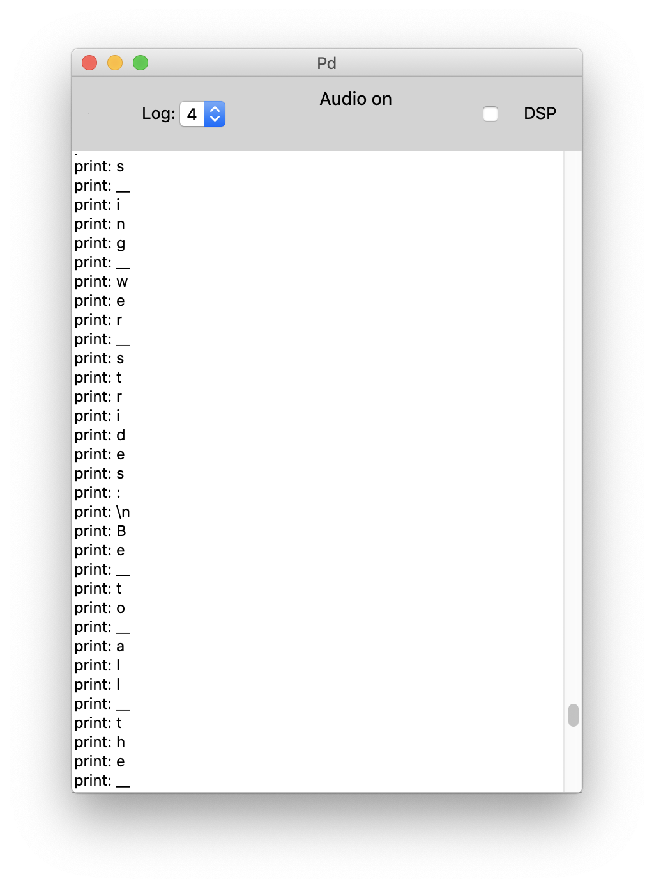

# Markov chain music
Davi Bedoya & Christian Steinmetz
12.02.2020

We use a second-order markov model on tokenized poems (at the character level) to write and sonify new poems.

## Usage

To start composing you must first load a properly formatted file which contains a list of tokenized characters take from a text corpus. We provide two pre-made files: `lyrics_code_ch.txt` (taken from song pop song lyrics) and `poems_code_ch.txt` (taken from Shakespeare poems). We also provide a Jupyter notebook (`convert_ch.ipynb`) that will allow you to use any text file corpus to create properly formatted input files. 

After you press **load code** and select a file, it will be analyzed and the markov model will be initialized. To begin creating music all you need is to press the **PLAY** toggle and ensure that you have an external MIDI instrument listening for notes. 

See an example composition [here](https://youtu.be/iXz9Xa6568Q)

## Controls

**PLAY** - As mentioned above this toggle starts and stops the generation of new characters and MIDI notes.
**RESTART** - This will restart the composition process by re-seeding the generation to the start of the supplied corpus.
**quarter_note_duration** - This slider lets you control how fast the overall tempo of the composition is.
**duration_probabilities** - With these four sliders you can control how likely each type of note is to be generated. This can help you dynamically change the rhythmic aspects. 
**staccato_->_legato** - With this control you can change the relative duration of a note with respect to its note duration. 
**gauss_velocity** - Here we provide two controls that let you adjust the dynamics of the performance. Changing the mean will adjust overall how loud or soft the notes are played, and increasing the std will result in more variation on each note. 
**SAVE** - This can be used to save the current text of the composition to disk (currently `./composition.txt`).
**CLEAR** - This will clear the composition cache.

## Features

One of the interesting features is that we are generating not only music but a poem that accompanies the music, which we then sonify in real-time. You can see the poem as it is being written in the terminal (as shown below). In this case we use `__`  to specify a space between words and `\n` for newline. 

In addition, we write all the notes being generated to a textfile so you can save your composition later and read it. The notation here is a bit cluttered and a future room for improvement would be to have a scheme that allows for us to save this data out in a better way along with the tokenized version, so we could feed back in poems we generated ourselves to the model.

## Collaboration

In this project, Davi developed the idea to use poems as a unique corpus for music generation. He also developed the Python code to allow us to tokenize different text corpora as input to our patch. Christian and Davi worked together to further refine the overall concept of operation. Davi's work also focused on the design of a system to have weighted probabilities of the different note durations. Christian worked to develop additional ways to impart randomness in the composition, as well as the methods to save and visualize the compositions in real-time. Christian also created the final demonstration videos. This was a fruitful collaboration we the combination of our ideas led us to an interesting result that had many features, and overall a nice interface for not only generating poems and sonifying them, but also for interacting with the composition process in real-time. 